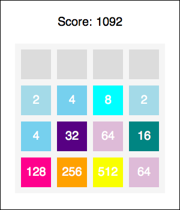

# Deux Exponential
Desktop-variant of 2048 game.

Found a really old project I did in the earlier days of undergrad, back when I was pretty addicted to this game for a while. Written in Racket because it's the language we learn in CPSC 110 at UBC for some reason, and because I enjoy putting myself through a lot of pain apparently!

# Usage
1. Download and install [DrRacket](https://download.racket-lang.org/).
2. Open the DeuxExponential.rkt file in DrRacket.
3. In the console, type `(main GSX)`, where X is any integer 1-5, and hit enter.
4. The rules of the game are similar. The goal is to get the value of any tile on the board to 2048. You control the movement of the tiles using the arrow keys. When a tile collides with another tile of the same value, they become one tile with the summed numerical value of the 2 tiles. You lose the game if the board is full and you have no moves left (i.e. none of the tiles can collapse with each other).
5. Enjoy :)